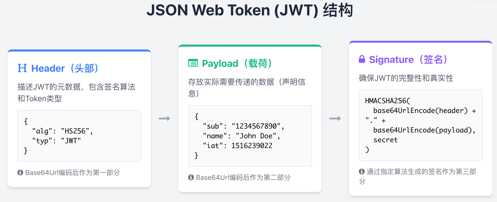
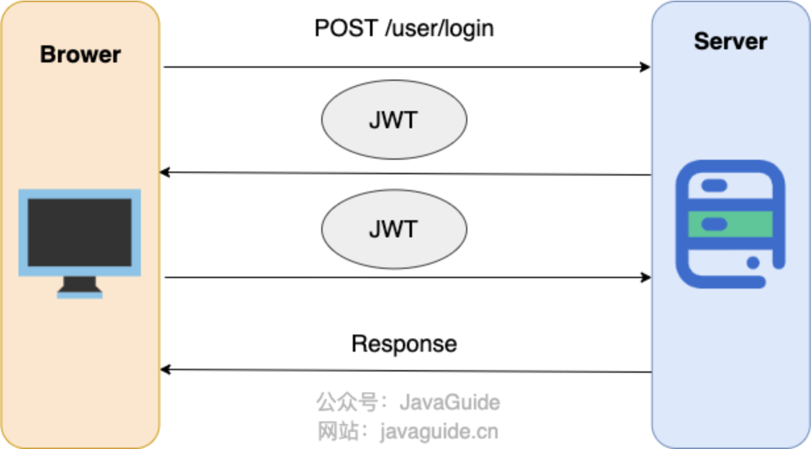

# JWT介绍与原理

## 什么是JWT？

JWT（JSON Web Token）是目前最流行的跨域认证解决方案，是一种基于Token的认证授权机制。从JWT的全称可以看出，JWT本身也是Token，一种规范化之后的JSON结构的Token。

JWT自身包含了身份验证所需要的所有信息，因此，服务器不需要存储Session信息。这增加了系统的可用性和伸缩性，大大减轻了服务端的压力。

**JWT更符合设计RESTful API时的「Stateless（无状态）」原则**。

使用JWT认证可以有效避免CSRF攻击，因为JWT一般是存在在localStorage中，使用JWT进行身份验证的过程中是不会涉及到Cookie的。

> JSON Web Token (JWT) is a compact, URL-safe means of representing claims to be transferred between two parties. The claims in a JWT are encoded as a JSON object that is used as the payload of a JSON Web Signature (JWS) structure or as the plaintext of a JSON Web Encryption (JWE) structure, enabling the claims to be digitally signed or integrity protected with a Message Authentication Code (MAC) and/or encrypted. —— [RFC 7519](https://tools.ietf.org/html/rfc7519)

## JWT的组成结构



JWT本质上就是一组字串，通过（`.`）切分成三个为Base64编码的部分：

### 1. Header（头部）
描述JWT的元数据，定义了生成签名的算法以及`Token`的类型。Header被Base64Url编码后成为JWT的第一部分。

Header通常由两部分组成：
- `typ`（Type）：令牌类型，也就是JWT
- `alg`（Algorithm）：签名算法，比如HS256

示例：
```json
{
  "alg": "HS256",
  "typ": "JWT"
}
```

### 2. Payload（载荷）
用来存放实际需要传递的数据，包含声明（Claims）。Payload被Base64Url编码后成为JWT的第二部分。

Claims分为三种类型：

#### Registered Claims（注册声明）
预定义的一些声明，建议使用，但不是强制性的：
- `iss`（issuer）：JWT签发方
- `iat`（issued at time）：JWT签发时间
- `sub`（subject）：JWT主题
- `aud`（audience）：JWT接收方
- `exp`（expiration time）：JWT的过期时间
- `nbf`（not before time）：JWT生效时间，早于该定义的时间的JWT不能被接受处理
- `jti`（JWT ID）：JWT唯一标识

#### Public Claims（公有声明）
JWT签发方可以自定义的声明，但是为了避免冲突，应该在[IANA JSON Web Token Registry](https://www.iana.org/assignments/jwt/jwt.xhtml)中定义它们。

#### Private Claims（私有声明）
JWT签发方因为项目需要而自定义的声明，更符合实际项目场景使用。

示例：
```json
{
  "uid": "ff1212f5-d8d1-4496-bf41-d2dda73de19a",
  "sub": "1234567890",
  "name": "John Doe",
  "exp": 15323232,
  "iat": 1516239022,
  "scope": ["admin", "user"]
}
```

**⚠️ 重要提示**：Payload部分默认是不加密的，**一定不要将隐私信息存放在Payload当中！！！**

### 3. Signature（签名）
服务器通过Payload、Header和一个密钥(Secret)使用Header里面指定的签名算法（默认是HMAC SHA256）生成。生成的签名会成为JWT的第三部分。

签名的计算公式如下：
```
HMACSHA256(
  base64UrlEncode(header) + "." +
  base64UrlEncode(payload),
  secret)
```

## JWT示例

一个典型的JWT格式：`xxxxx.yyyyy.zzzzz`

示例：
```
eyJhbGciOiJIUzI1NiIsInR5cCI6IkpXVCJ9.
eyJzdWIiOiIxMjM0NTY3ODkwIiwibmFtZSI6IkpvaG4gRG9lIiwiaWF0IjoxNTE2MjM5MDIyfQ.
SflKxwRJSMeKKF2QT4fwpMeJf36POk6yJV_adQssw5c
```

可以在[jwt.io](https://jwt.io/)这个网站上对JWT进行解码。

## 基于JWT的身份验证流程



简化后的步骤如下：

1. **用户登录**：用户向服务器发送用户名、密码以及验证码用于登陆系统
2. **生成Token**：如果用户用户名、密码以及验证码校验正确，服务端会返回已经签名的Token（JWT）
3. **客户端保存**：客户端收到Token后保存起来（比如浏览器的`localStorage`）
4. **携带Token请求**：用户以后每次向后端发请求都在Header中带上这个JWT
5. **服务端验证**：服务端检查JWT并从中获取用户相关信息

### 建议做法：
1. **存储位置**：建议将JWT存放在localStorage中，放在Cookie中会有CSRF风险
2. **传输方式**：请求服务端并携带JWT的常见做法是将其放在HTTP Header的`Authorization`字段中（`Authorization: Bearer Token`）

## JWT安全性

### 如何防止JWT被篡改？
有了签名之后，即使JWT被泄露或者截获，黑客也没办法同时篡改Signature、Header、Payload。

服务端拿到JWT之后，会解析出其中包含的Header、Payload以及Signature。服务端会根据Header、Payload、密钥再次生成一个Signature。拿新生成的Signature和JWT中的Signature作对比，如果一样就说明Header和Payload没有被修改。

**⚠️ 注意**：如果服务端的秘钥也被泄露的话，黑客就可以同时篡改Signature、Header、Payload了。

### 如何加强JWT的安全性？
1. **使用安全算法**：使用安全系数高的加密算法
2. **使用成熟库**：使用成熟的开源库，没必要造轮子
3. **存储位置**：JWT存放在localStorage中而不是Cookie中，避免CSRF风险
4. **隐私信息**：一定不要将隐私信息存放在Payload当中
5. **密钥安全**：密钥一定保管好，一定不要泄露出去。JWT安全的核心在于签名，签名安全的核心在密钥
6. **设置过期时间**：Payload要加入`exp`（JWT的过期时间），永久有效的JWT不合理。并且，JWT的过期时间不宜过长

## 优缺点分析

### 优点
1. **无状态**：JWT自身包含了身份验证信息，服务器不需要存储Session
2. **跨域友好**：适合跨域认证场景
3. **避免CSRF**：不依赖Cookie，有效避免CSRF攻击
4. **易于扩展**：Payload可以包含自定义信息
5. **标准化**：基于RFC标准，有良好的生态支持

### 缺点
1. **Token大小**：JWT比Session ID大，增加网络开销
2. **无法废止**：一旦签发，在过期前无法废止（除非使用黑名单机制）
3. **密钥管理**：密钥泄露会导致安全问题
4. **Payload不加密**：默认不加密，敏感信息可能泄露

## 相关资源

- [JWT官方网站](https://jwt.io/)
- [RFC 7519 - JSON Web Token (JWT)](https://tools.ietf.org/html/rfc7519)
- [IANA JSON Web Token Registry](https://www.iana.org/assignments/jwt/jwt.xhtml)
- [spring-security-jwt-guide](https://github.com/Snailclimb/spring-security-jwt-guide) - 基于JWT的身份认证简单案例
- [JWT优缺点分析](https://javaguide.cn/system-design/security/advantages-and-disadvantages-of-jwt.html)

## 总结

JWT是一种优秀的无状态认证方案，特别适合现代分布式系统和RESTful API。正确使用JWT需要：
1. 理解其组成结构和工作原理
2. 注意安全性最佳实践
3. 根据实际场景合理设计Token的有效期和内容
4. 妥善保管签名密钥

对于需要即时废止Token或对Token大小敏感的场景，需要结合其他方案进行优化。